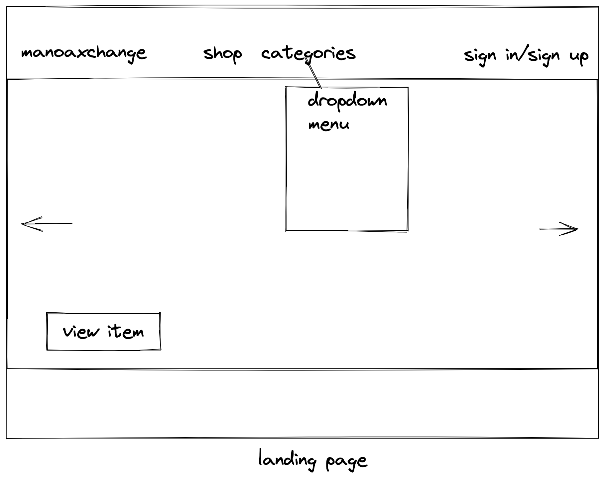
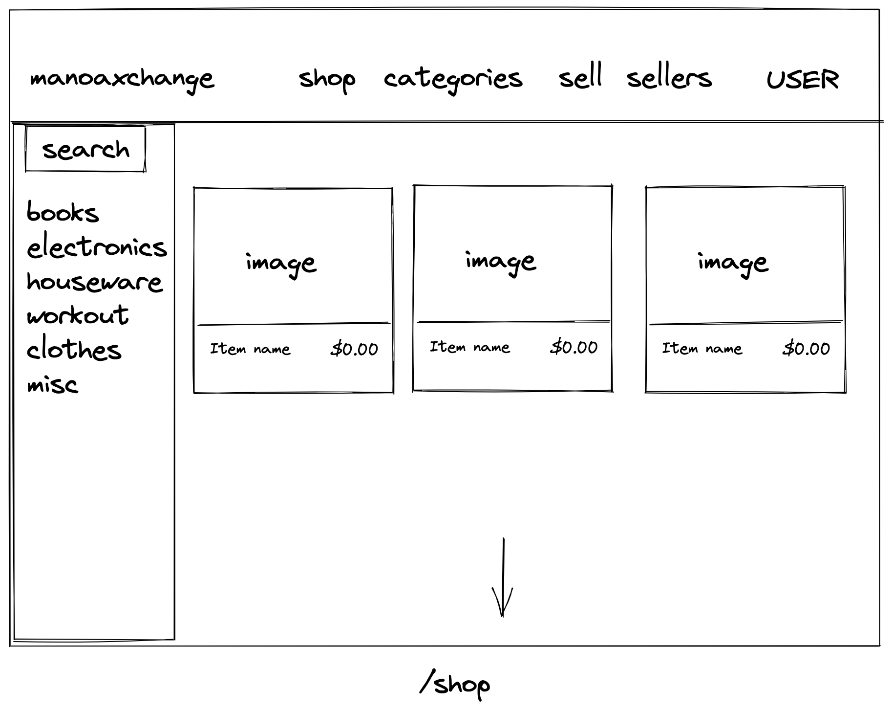
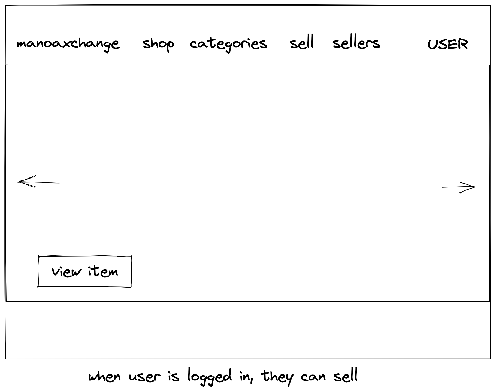
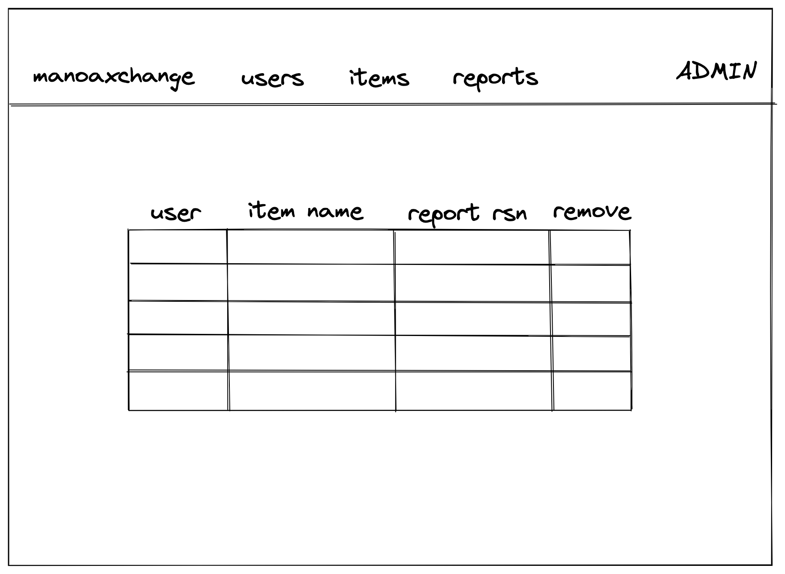
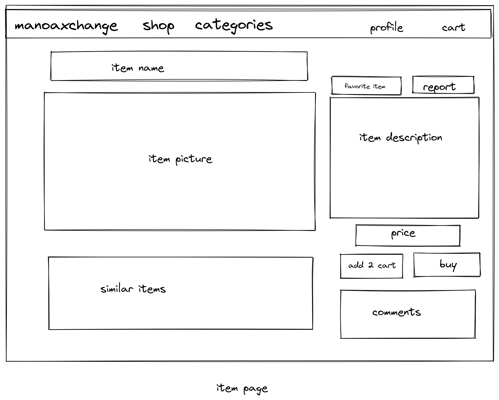
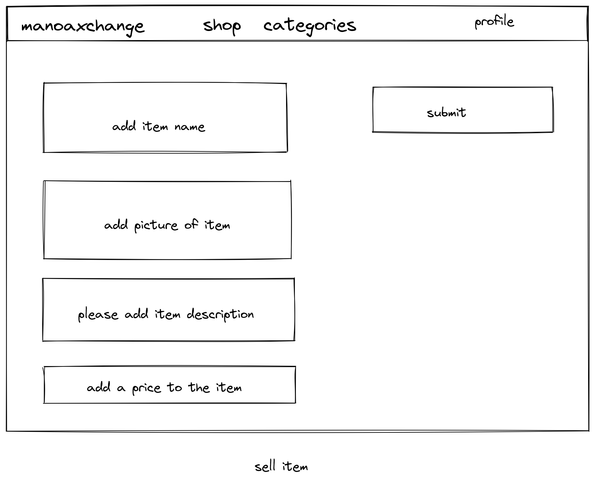
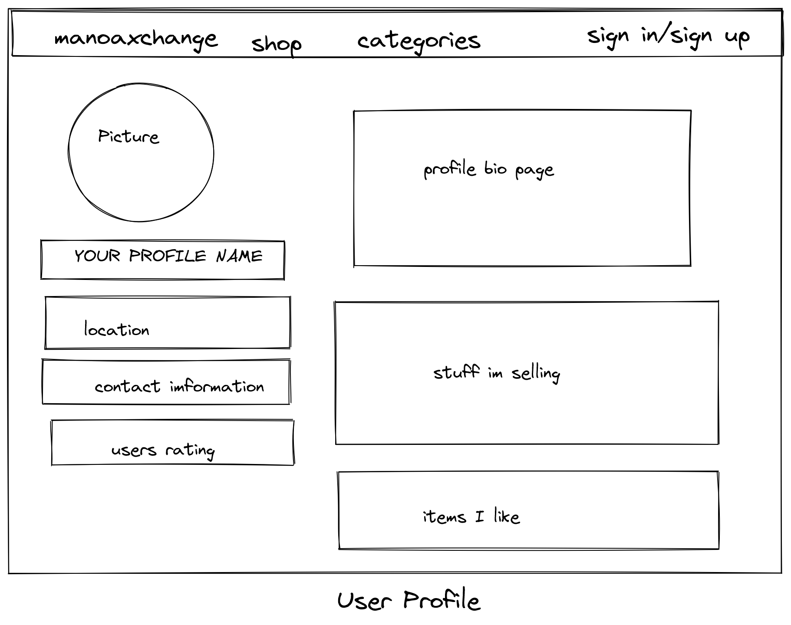

# Manoa Xchange
## Overview

Living on campus tends to be a short lived experience. Many students either move into off campus housing or go abroad to after finishing their degree(s). Lots of campus specific goods are built up

## Goals

Large masses of students quickly come and go in the dorms of UH Manoa. This leads to lots of campus specific items that are discarded by previous students. Our goal is to create an application that helps to promote and incentivize buying and selling goods between the students of UH Manoa. This allows students to reuse and repurpose items that were used by other students, reducing the amount of items that were going to be discarded. 

## What our Application provides

Our application provides a marketplace for students to purchase and sell goods. Anybody can browse the marketplace, and can easily search the marketplace by using a search bar or using one of many premade filters. However, there is more site functionality when people log in as a User (aka UHM student). Users are able to browse the marketplace, and are able to browse sellers and their user profile page (that lists the user's wares and rating). Users are also able to order/offer/buy goods from the marketplace, and create/list goods on the marketplace. Users are also able to report users and/or items on the markertplace. Admins are able to remove items on the marketplace that are deemed as unsafe, inappropriate, or illegal.

## Mockup Pages

### Landing Page

### Shop Page

### Logged In User

### Admin

### Item Page

### Sell Page

### Profile

