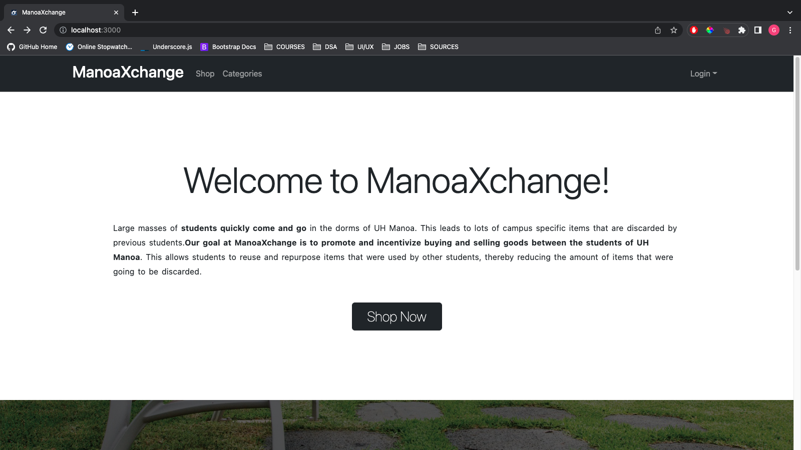
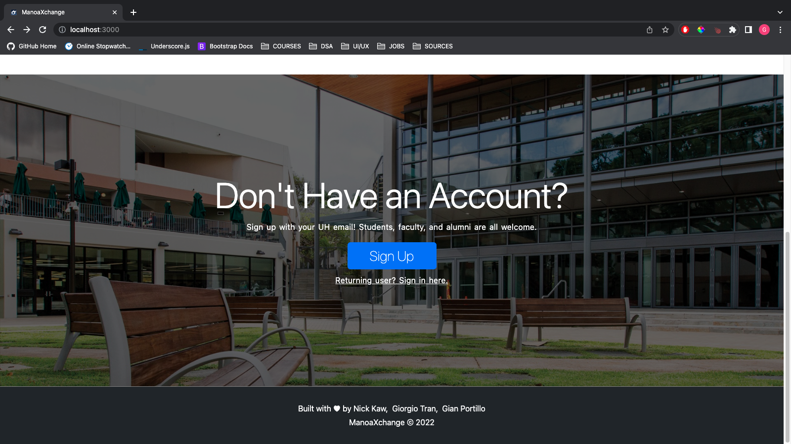
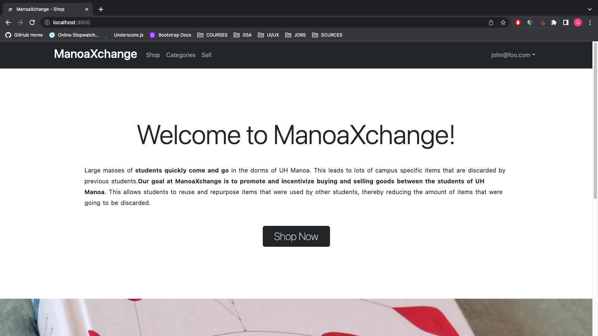
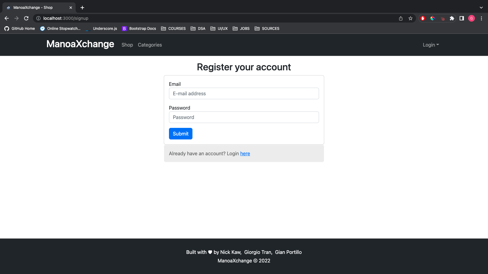
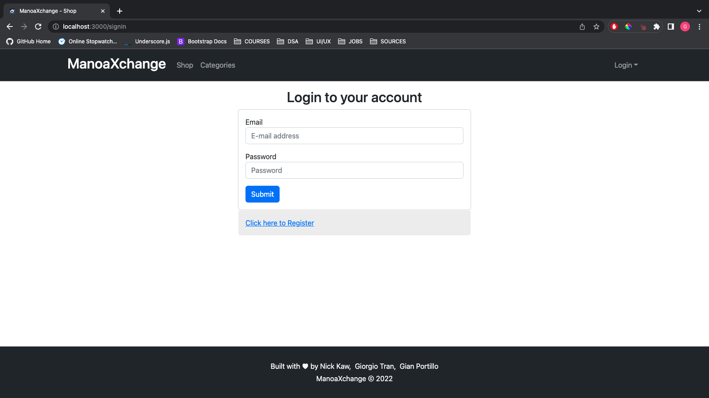
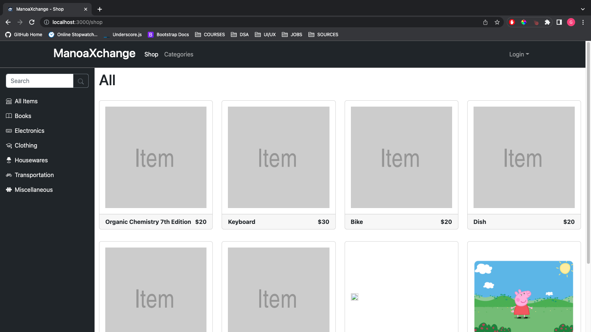
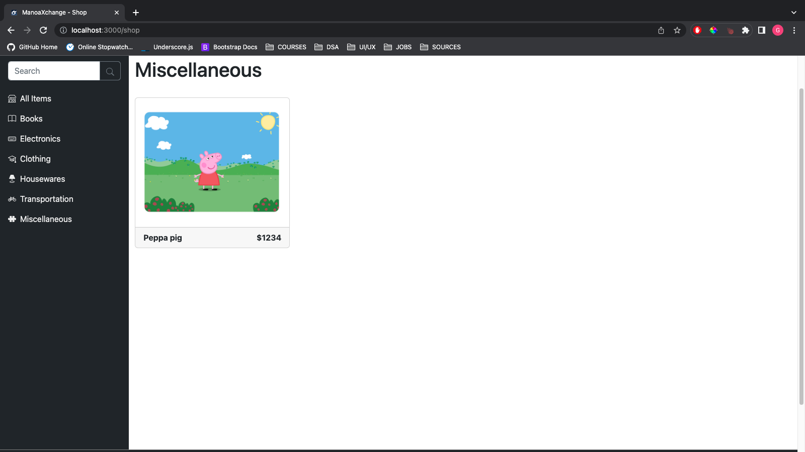
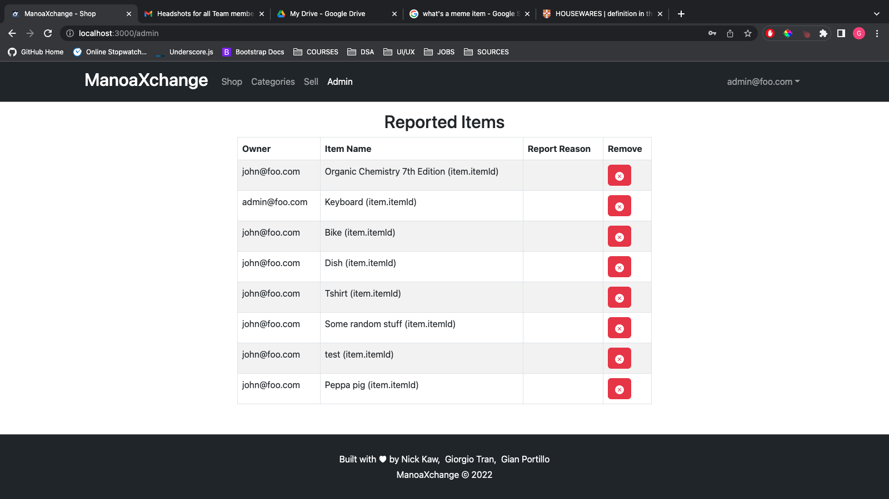
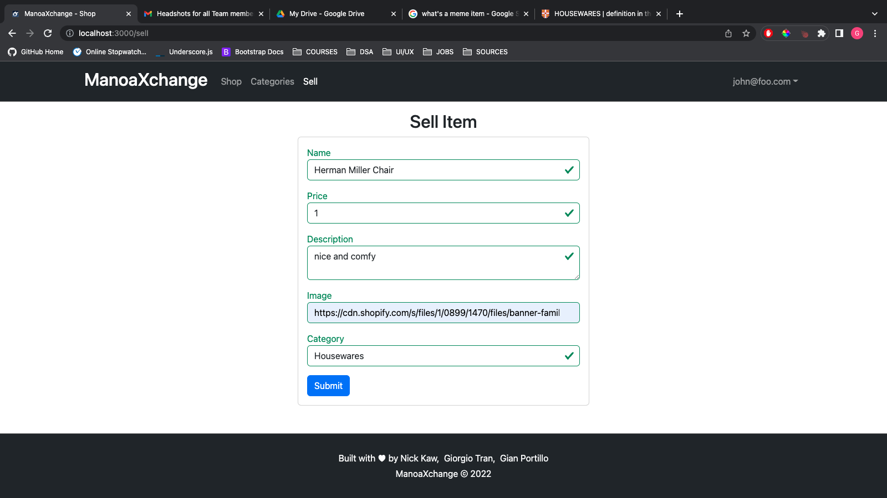

# Manoa Xchange
## Overview

Living on campus tends to be a short lived experience. Many students either move into off campus housing or go abroad after finishing their degree(s). Lots of campus specific goods are built up, and there is a need for a marketplace where students can buy and sell them. Introducing Manoa Xchange, a convenient marketplace application that does just that! For more information continue reading or check out our [Organization Page](https://github.com/manoaxchange).

## Goals

Large masses of students quickly come and go in the dorms of UH Manoa. This leads to lots of campus specific items that are discarded by previous students. Our goal is to create an application that helps to promote and incentivize buying and selling goods between the students of UH Manoa. This allows students to reuse and repurpose items that were used by other students, reducing the amount of items that were going to be discarded. 

## What our Application provides

Our application provides a marketplace for students to purchase and sell goods. Anybody can browse the marketplace, and can easily search the marketplace by using a search bar or using one of many premade filters. However, there is more site functionality when people log in as a User (aka UHM student). Users are able to browse the marketplace, and are able to browse sellers and their user profile page (that lists the user's wares and rating). Users are also able to order/offer/buy goods from the marketplace, and create/list goods on the marketplace. Users are also able to report users and/or items on the markertplace. Admins are able to remove items on the marketplace that are deemed as unsafe, inappropriate, or illegal.

## Deployment

You can access our (in working) deployed website here:
[Manoa Xchange](http://188.166.104.165/)

## User Guide

The following sections provides a walkthrough of ManoaXchange's user interface and application features. As this project is in development, every page is accessible but not fully functional.

### Landing Page
This page is visible to people who first land on the site and contains a welcome message for everyone.
##### Not Logged In
If you are not logged in, then you will have a landing page with 'shop' and 'categories' as navbar options. Also, there is a sign up prompt underneath the welcome message.

##### Logged In
If you are logged in as a user, then the navbar will have an added 'sell' option. Also, there is a carousel that shows ranodm items in the store underneath the welcome message.

### Sign-Up Page
New users without an account can sign up on this page.

### Sign-In Page
Users with an existing account or after registering, users can now login to the site on this page.

### Shop Page
The shop page is available for anybody, and it shows items. There is also a side menu where users can select what category they are interested in or they can search for items.

### Admin
The admin can see all of the users, and all of the items. Reports will be displayed on the admin's home page.

### Item Page
The item page contains all of the information about the item, and the item can be purchased or added to cart.

### Sell Page
Users can also post items for sale.

### Profile
Each member has a profile page that can be visited by other users.

## Development History

The following sections document the development history of ManoaXchange.

### Milestone 1 - Basic Necessities
For the first milestone, the goal is to create the mockup pages, and creating the basic schema of the items.
Milestone 1 was managed using [Manoaxchange GitHub Project Board M1](https://github.com/orgs/manoaxchange/projects/1)

### Milestone 2 - Connecting Databases & Refining UI
For the second milestone, the goal is to polish up and refine our application. Existing pages will look less bare with additional CSS/bootstrap properties, and our collection database will have connections between each other and function correctly.
Milestone 2 was managed using [Manoaxchange GitHub Project Board M2](https://github.com/orgs/manoaxchange/projects/2)

## Team Members

Manoa Xchange was designed and implemented by Nicholas Kaw, Gian Portillo, and Giorgio Tran. Since this project was not supervised by a project manager, all members contributed and adhered to the [Team Contract](https://docs.google.com/document/d/10dSg54SKbQ1Hqc51PzH4RVmZYIIof93CubZPhwS6ZQs/edit?usp=sharing).

If you have any comments or questions, feel free to contact us on our via GitHub or email:
- [Nicholas Kaw](https://github.com/nickkaw) | <kawn@hawaii.edu>
- [Gian Portillo](https://github.com/Geeean) | <gtp@hawaii.edu>
- [Giorgio Tran](https://github.com/giorgio-tran) | <ttran2@hawaii.edu>

## Brainstorming
- Possibly using Amazon S3 for image uploading or Cloudinary
- Implementing rating system for both sellers and items

## Community Feedback

Coming soon!

## Developer Guide

Coming soon!
